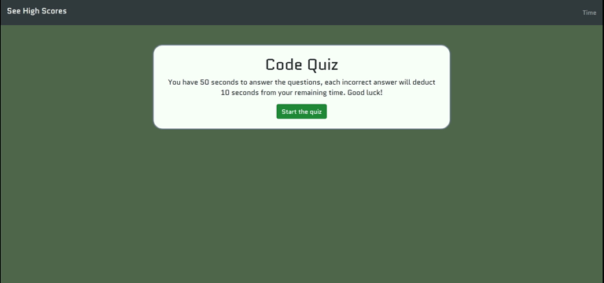

# JavaScript Code Quiz
This is a timed multiple choice quiz over js, [link to deployed project here](https://tsgrewing.github.io/JS_Code_Quiz/). 

## Description
A short quiz consisting of five multiple choice questions, that can be expanded to ask how ever many questions might be needed. There is a timer that is based on the number of questions, which gives the quiz taker 10 seconds per question. If the taker gets a question incorrect, there is a 10 second penalty. The quiz taker will see a message to let them know if they were correct, and if they were incorrect the correct answer will also be displayed. At the end of the quiz the quiz taker is shown their score, based on number of correct answers and time remaining after the last question is answered. They also have the opportunity to enter their initials, which will then be stored locally along with their score, and added to the high scores list, which is ranked from highest to lowest. 

## Demo

